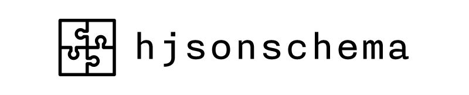

A Haskell implementation of the current [JSON Schema](http://json-schema.org/) specification (Draft 4).

[Hackage](https://hackage.haskell.org/package/hjsonschema) / [GitHub](https://github.com/seagreen/hjsonschema) / [Travis CI](https://travis-ci.org/seagreen/hjsonschema)

NOTE: You CANNOT use untrusted JSON data to make schemas. Schemas with circular references can cause infinite loops. See the issue list for more info.

# Example

See [here](https://github.com/seagreen/hjsonschema/blob/master/examples/Standard.hs).

# Tests

## Install

`git submodule update --init`

## Run

Will run self-contained:

`cabal test local`

Will start an HTTP server temporarily on port 1234:

`cabal test remote`

# Details

## Goals

+ Be a correct and fast implementation of the spec.

+ Be a useful reference for implementers in other languages. Haskell's high level nature, expressive type system and referential transparency suit this purpose well.

## Good Parts

+ Passes all the tests in the [language agnostic test suite](https://github.com/json-schema/JSON-Schema-Test-Suite).

+ Very modular, which should make it easy to support future versions of the specification.

## Bad Parts

+ Uses the [pcre-heavy](https://hackage.haskell.org/package/pcre-heavy) regular expression library for the "pattern" validator. It should use a library based on the ECMA 262 regex dialect, which the [spec](http://json-schema.org/latest/json-schema-validation.html#anchor33) requires.

## Notes

+ `src/draft4.json` is from commit # cc8ec81ce0abe2385ebd6c2a6f2d6deb646f874a [here](https://github.com/json-schema/json-schema).

## Credits

[TJ Weigel](http://tjweigel.com/) created the logo.

[Tim Baumann](https://github.com/timjb) wrote [aeson-schema](https://hackage.haskell.org/package/aeson-schema), on which hjsonschema's test code and its implementation of `SchemaGraph` were based.

[Julian Berman](https://github.com/Julian) maintains the fantastic [language agnostic test suite](https://github.com/json-schema/JSON-Schema-Test-Suite).
